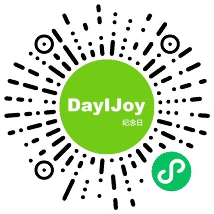

### 纪念日APP

#### 项目简介
纪念日APP是一个基于微信小程序的应用，旨在帮助用户记录和提醒重要的纪念日。前端使用微信原生开发，后端基于Express框架，数据库使用MySQL进行数据存储。

---

#### 在线体验

---

#### 项目结构
- **前端**：微信小程序原生开发，包含各类页面（如首页、添加纪念日、设置页面等）。
- **后端**：使用Node.js和Express框架开发，提供API接口与前端通信。
- **数据库**：MySQL，存储用户信息、纪念日数据等。

---

#### 使用注意事项

1. **开发环境要求**：
   - 前端：需要安装微信开发者工具。
   - 后端：Node.js（推荐版本16.15.1 以上）和npm。
   - 数据库：MySQL（推荐8.0.26 以上版本）。

2. **配置文件**：
   - **前端配置**：在`project.config.json、/config/config.js 和 app.js`文件中配置项目的AppID和其他小程序相关参数。
   - **后端配置**：在项目根目录下的`config.js`文件中设置数据库连接信息和其他环境变量。

3. **安装依赖**：
   - 前端：使用微信开发者工具直接导入项目，依赖已存在项目中。
   - 后端：在项目根目录下运行`npm install`命令，安装所需的npm依赖。

4. **启动项目**：
   - **后端启动**：
     1. 确保MySQL服务已启动并正确配置。
     2. 在项目根目录下运行`npm run dev`启动Express服务器。
   - **前端启动**：
     1. 使用微信开发者工具打开前端项目目录。
     2. 确保开发工具中的小程序设置与后端API地址匹配。

5. **注意事项**：
   - **安全性**：请勿将敏感信息（如数据库密码和API密钥）硬编码到源代码中。使用环境变量或安全存储解决方案。
   - **数据备份**：定期备份MySQL数据库，防止数据丢失。
   - **API请求**：确保前端的API请求地址与后端的实际地址一致。建议在开发和生产环境中使用不同的配置文件来管理API地址。

6. **贡献指南**：
   - 欢迎任何形式的贡献！请在提交PR前确保您的代码符合项目的代码风格，并通过了所有测试。
   - 在提交问题或功能请求之前，请先查看[问题追踪器](link to issue tracker)以确保没有重复的条目。

7. **许可证**：
   - 本项目基于MIT许可证开源，请参阅`LICENSE`文件以了解详细信息。

---

希望这些使用注意事项能帮助您快速入门和高效使用纪念日APP。如果有任何问题或建议，请随时在项目的[GitHub仓库](link to GitHub repo)上提交issue。祝使用愉快！